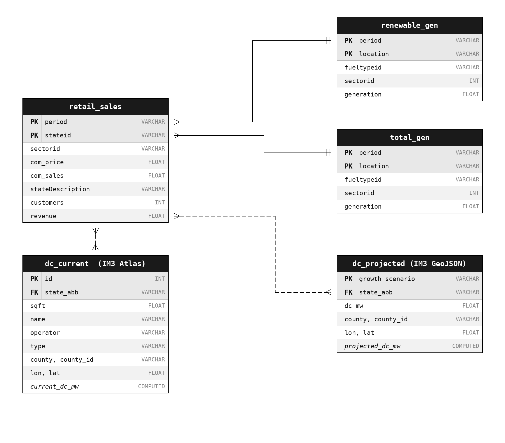

# DS 4320 Project 1: Predicting Commercial Electricity Price Impacts from Data Center Growth Across the United States

**Name:** Ethan Cao

**NetID:** wkt7ne

**DOI:** [10.5281/zenodo.19363472](https://doi.org/10.5281/zenodo.19363472)

**License:** MIT — [LICENSE](LICENSE)

**Press Release:** [press_release.md](press_release.md)

**Data:** [UVA OneDrive](https://myuva-my.sharepoint.com/:f:/g/personal/wkt7ne_virginia_edu/IgAnZv32gJWCT5OvMZHNHLbRASdhLY7_QWsDXghfffwreWA?e=dzkXL8)

**Pipeline:** code/pipeline.ipynb 

---

## Executive Summary
This project is a full end-to-end predictive modelling pipeline that predicts how projected data center growth will affect commercial electricity prices across U.S. states. Using EIA retail electricity data from 2015 to 2026 and IM3's projected data center growth scenarios, an XGBoost regression model is trained and optimized to estimate state-level commercial electricity prices amid the projected growth in the number of data centers across the U.S. at 2040, under four growth scenarios: low, moderate, high, and higher. Results are presented in a choropleth map and a heatmap to show the change in price predicted by each state and each growth scenario.

---

## Problem Definition

### General Problem:
- How do we forecast energy demand increase amid potential increase in energy usage and industry adoption in the future?
### Specific Problem:
- Given projected data center construction across the United States, how much will commercial electricity prices rise in each state by the time those data centers are built and put into action? 

### Rationale for Refinement:
- Data centers are one of the fastest-growing sources of electricity demand in the United States. The IM3 research group at Pacific Northwest National Laboratory has published detailed county-level projections of data center growth through 2040, broken into four scenarios. The EIA publishes monthly state-level commercial electricity prices and sales going back to 2001. These two datasets can be linked through state and time range, making it possible to train a model that isolates and discovers how the **increasing in energy consumption of data centers** can **affect the price** that all commercial customers pay, including the potential prices that residential customers may have to pay given the unfortunate close proximity to data centers.

### Motivation
- Data centers now consume roughly 4% of U.S. electricity and that share is growing rapidly due to the frantic and seemingly unstoppable adoption of AI workloads by corporate entities across the country. When a large data center cluster enters a state's grid, it increases demand on the transmission and generation infrastructure, which can raise prices for all commercial ratepayers in that state. Entities like hospitals, schools, and even small business that had no role in part of that growth will likely suffer from the injection of such infrastructure. Given this, this project aims to quantify the potential impact by using real historical data and published growth projections, to inform policy makers, grid balance authorities, and affected communities about the sustainability (or the lack of sustainability) of the rapid growth of data center adoption, and to hopefully making meaningful decisions about building these infrastructures before it creates an irreversible impact on its innocent neighborhood and communities.

### Press Release Headline:

**"The AI Boom Could Cost You Dearly: The explosion in demand fo data centers by corporate giants is projected to raise electricity bills across dozens of states."**

[Read the full press release](press_release.md)

---

## Domain Exposition
**Terminology**

| Term                         | Definition                                                                                                                                                        |
| ---------------------------- | ----------------------------------------------------------------------------------------------------------------------------------------------------------------- |
| Commercial electricity price | Price per kilowatt-hour paid by commercial customers (offices, retail, schools), in cents/kWh                                                                     |
| com_sales                    | Total commercial electricity consumed in a state in a given month, in million kWh                                                                                 |
| dc_intensity                 | Data center MW capacity divided by commercial sales — normalizes DC load by state grid size                                                                       |
| renewable_pct                | Fraction of a state's total electricity generation that came from renewable sources that month                                                                    |
| state_encoded                | Integer label assigned to each state so XGBoost can learn each state's baseline price level                                                                       |
| growth scenario              | One of four IM3 projections: low, moderate, high, or higher — reflects different assumptions about AI adoption and construction rates                             |
| market gravity               | IM3 parameter controlling how DCs cluster within a state; has no effect at the state level used here since we predict state-level prices, not within-state prices |
| dc_mw                        | Estimated megawatt capacity of a data center, computed as square footage / 10,000 per the LBNL 2024 industry standard                                             |
| RMSE                         | Root mean squared error — primary evaluation metric, measuring the average magnitude of prediction error in cents/kWh                                             |
| bias correction              | A constant added to model predictions to correct for systematic underprediction on out-of-sample years                                                            |
| trend correction             | A linear year-based offset added to predictions to recover price growth beyond the training window                                                                |

### Domain Background
- This project is at the domain of energy economics, policy making, and infrastructure planning. Since U.S. electricity markets are regulated at the state level, meaning that price dynamics differ significantly by the region one is examining at. For example states with cheap hydropower (such as Washington and Oregon) may have structurally lower prices than those who are reliant on natural gas (such as New England). Although the strong adoption of renewable energy sources has pushed prices down in states with an abundance of those resources, the recent years of increase in demand for data centers can offset those gains by requiring huge transmission of electricity to support their workloads. The IM3 modeling framework captures these geographic dynamics by projecting where data centers are likely to be built based on the land, power, and connectivity constraints. This project uses the state-level sums/aggregate of those projections as a demand signal to feed into a machine learning model, to be trained on historical price and consumption data to predict whether the sudden injection of huge volumes of data centers may lead to the hypothesized 'disastrous' rise in electricity costs.

### Background Readings:
| #   | Title                                                                                 | Description                                                                                                                                            | Link                                                                                                                                         |
| --- | ------------------------------------------------------------------------------------- | ------------------------------------------------------------------------------------------------------------------------------------------------------ | -------------------------------------------------------------------------------------------------------------------------------------------- |
| 1   | AI is Poised to Drive 160% Increase in Data Center Power Demand (Goldman Sachs, 2024) | Industry analysis projecting explosive electricity demand growth from AI workloads through 2030                                                        | [background_readings/01_goldman_sachs_ai_data_center_power_demand.pdf](background_readings/01_goldman_sachs_ai_data_center_power_demand.pdf) |
| 2   | Energy and AI (IEA, 2024)                                                             | IEA report projecting global data center power demand to double to 945 TWh by 2030, with the US accounting for ~45% of consumption                     | [background_readings/02_iea_energy_and_ai_2024.pdf](background_readings/02_iea_energy_and_ai_2024.pdf)                                       |
| 3   | Mapping the Future of Data Centers (PNNL, 2024)                                       | Full report detailing the IM3 data center atlas, the CERF siting model, four growth scenarios, and the market gravity methodology used in this project | [background_readings/03_pnnl_mapping_future_data_centers.pdf](background_readings/03_pnnl_mapping_future_data_centers.pdf)                   |
| 4   | The Era of Flat Power Demand is Over (Grid Strategies, 2023)                          | First major report identifying that US utility load forecasts were surging after decades of flat growth, driven primarily by data centers              | [background_readings/04_grid_strategies_era_of_flat_power_demand.pdf](background_readings/04_grid_strategies_era_of_flat_power_demand.pdf)   |
| 5   | eScholarship UC — Data Center Energy Study                                            | Academic paper on data center energy consumption and efficiency trends from the UC system                                                              | [background_readings/05_escholarship_data_center_energy.pdf](background_readings/05_escholarship_data_center_energy.pdf)                     |

## Data Creation:

### Provenance:
All data are sourced and specifically requested through communications with the laboratories / government repositories that provide them. teh EIA retail electricity sales and pricing data were downloaded from the U.S. Energy Information Administration's Open Data API (api.eia.gov), which covers monthly state level commercial sector prices and sales from Janurary 2015 through early 2026. The renewable and total generation data were also pulled from EIA's electricity generation tables for the same period. The Data Center Location and Size data was requested through the Pacific Northwest National Laboratory, in which the api to access the IM3 Open Source Data Center Atlas was **authorized by Casey D. Burleyson, Scientist at the PNN lab under the Atmospheric, Climate, and Earth Sciences Division**. This dataset catalogs the existing U.S. data centers with square footage as well as provide county level projections of the new data centers under four growth rate scenarios. 

### Code:

| File                          | Description                                                                                                                                                                                          | Link                                                           |
| ----------------------------- | ---------------------------------------------------------------------------------------------------------------------------------------------------------------------------------------------------- | -------------------------------------------------------------- |
| code/pipeline.ipynb           | Main pipeline: loads all five tables into DuckDB, engineers features, runs grid search, trains XGBoost, evaluates on validation and test sets, and generates scenario predictions and visualizations | [code/pipeline.ipynb](code/pipeline.ipynb)                     |
| code/dataset_inspection.ipynb | Exploratory analysis notebook used to inspect raw EIA and IM3 datasets, check column types, and validate join keys before building the main pipeline                                                 | [code/dataset_inspection.ipynb](code/dataset_inspection.ipynb) |
| code/adhoc_analysis.py        | Ad hoc Python script used during development to run quick queries against the raw data files and validate intermediate outputs                                                                       | [code/adhoc_analysis.py](code/adhoc_analysis.py)               |

### Bias Identification:
- **Selection bias / confounding**: Data centers historically prefer states with cheaper electricity (Virginia, Oregon, Texas) because lower energy costs directly reduce their operating expenses. This means that in the raw cross-sectional data, states with more data centers tend to already have lower electricity prices, creating a misleading negative correlation between data center presence and price. A naive model trained on this pattern would incorrectly conclude that more data centers lead to cheaper electricity, which is the exact opposite of the causal direction this project is trying to capture.
- **Temporal feature confounding from the 2022 energy crisis**: The year 2022 saw a nationwide spike in electricity prices driven by geopolitical factors and natural gas supply disruptions that had nothing to do with data center growth. If treated carelessly, this spike could distort the model's understanding of the year-over-year price trend, causing it to overweight crisis-level prices as a normal pattern.
- **Conversion assumption bias**: The 1 MW per 10,000 sqft rule used to estimate data center energy consumption is an industry average, not a measured value for each facility. Actual power density varies considerably by facility age, cooling technology, and workload type. This introduces systematic uncertainty into the dc_intensity feature, particularly for older or smaller facilities that may operate at much lower densities than modern hyperscale campuses.
- **Extrapolation bias**: XGBoost, as a tree-based model, cannot extrapolate beyond the range of values it saw during training. Since the training data covers years 2015 to 2022, the model effectively treats all future years as equivalent to 2022, hence causing it to underestimate prices for 2024 to 2026 where the real-world trend has continued upward.

### Bias Mitigation:
- Selection bias is partially addressed by including `state_encoded` as a feature to the ML model, which allows the model to control for each state's structural baseline price level and thereby isolating the within-state relationship between data center growth and price changes.The 2022 energy crisis year is included in the training set (rather than excluded) so the model learns that such spikes or 'black swan events' are possible, hence reduces potential 'surprises' if the model fails to accurately take into account of non-linear price changes due to unexpected events. A linear trend correction is also applied post-hoc of the model training to account for the fact that XGBoost cannot properly extrapolate the year feature beyond its training range, which would otherwise cause systematic under prediction behavior that did not match what the real world price changes looked like.

### Rationale for Critical Decisions:
- **1 MW per 10,000 sqft**: Used to convert IM3 square footage to energy consumption, following the LBNL 2024 report's industry average. This is an estimation for individual data center energy consumption, in which although actual power density varies by facility type and location, such data is not available at this moment in time, hence this compromise must to be made to ensure each data center's energy consumption footprint can be as closely quantified as possible.
- Separating the dataset into: **Training set - 2015–2022**, **Validation set - 2023**, and **Testing set - 2024–2026**. Such dataset splitting (by time) ensures the model never sees future data. 2023 serves as validation for hyperparameter selection; 2024–2026 is a fully held-out test set to see model performance under unseen data. The training set is given as much years as possible to better allow the model to learn the subtle relationships between years and eletrical pricing dynamics. 
- Only **50% gravity weight** is loaded for the complete dataset: IM3's market gravity parameter only affects within-state county distribution of DCs, not the state-level energy consumption rate in total. Therefore all gravity weights produce identical state-level predictions, so a single weight is loaded to avoid redundancy as it would be not efficient nor necessary to have the model to predict all scenarios with state-level energy consumption predictions.
- Choosing **dc_intensity over raw dc_mw**: Dividing by com_sales normalizes the metric for state size. For example, a 1,000 MW of new data center load in Texas is a small fraction of commercial demand; Meanwhile the data center same load in Rhode Island would be enormous. Hence normalization is essential to ensure equal comparison.

---

## Metadata

### Schema

### Data Tables

| Table                                             | Description                                                                                            | Rows    | OneDrive                                                                                                                                | Local                                                                                                      |
| ------------------------------------------------- | ------------------------------------------------------------------------------------------------------ | ------- | --------------------------------------------------------------------------------------------------------------------------------------- | ---------------------------------------------------------------------------------------------------------- |
| eia_retail_sales_2015_2026.csv                    | Monthly commercial electricity price and sales by state, 2015–2026, sourced from the EIA Open Data API | 49,476  | [OneDrive](https://myuva-my.sharepoint.com/:f:/g/personal/wkt7ne_virginia_edu/IgBu1M_PXjJVT5cEbY0a-N3PAbiynU9bMgIWs6iTO8BNoLM?e=EGm6GJ) | [data/eia_retail_sales_2015_2026.csv](data/eia_retail_sales_2015_2026.csv)                                 |
| eia_renewable_generation_2015_2026.csv            | Monthly renewable electricity generation by state and fuel type, 2015–2026                             | 179,652 | [OneDrive](https://myuva-my.sharepoint.com/:f:/g/personal/wkt7ne_virginia_edu/IgDJF5k4poqWSoDodu-3QKccAWjGrzJPivCm3Foe59kcu00?e=nKyxxl) | [data/eia_renewable_generation_2015_2026.csv](data/eia_renewable_generation_2015_2026.csv)                 |
| eia_total_generation_2015_2026.csv                | Monthly total electricity generation by state and fuel type, 2015–2026                                 | 194,055 | [OneDrive](https://myuva-my.sharepoint.com/:f:/g/personal/wkt7ne_virginia_edu/IgAzxt-2UMTnSqcrsW55o2PuAZDHbChf44pz--2PBM7Dd4U?e=MnqkVe) | [data/eia_total_generation_2015_2026.csv](data/eia_total_generation_2015_2026.csv)                         |
| im3_open_source_data_center_atlas_v2026.02.09.csv | Existing U.S. data centers with state, county, square footage, operator, and coordinates               | ~8,000  | [OneDrive](https://myuva-my.sharepoint.com/:f:/g/personal/wkt7ne_virginia_edu/IgAE7S2vPCQzT4_Hy70lZXN0AYktIQ3TfGMxhJpl6A_FBnI?e=3Cjrus) | [data/im3_open_source_data_center_atlas_v2026.02.09/](data/im3_open_source_data_center_atlas_v2026.02.09/) |
| im3_projected_data_centers_v1.1 (GeoJSON)         | Projected new data center locations by county under 4 growth scenarios (low, moderate, high, higher)   | ~3,329  | [OneDrive](https://myuva-my.sharepoint.com/:f:/g/personal/wkt7ne_virginia_edu/IgDUifhUFQ1sSpVkZAe7Eg4bAcMG67uSfiRYTsNYZKqlBQE?e=uUErfp) | [data/im3_projected_data_centers_v1.1/](data/im3_projected_data_centers_v1.1/)                             |

### Data Dictionary

| Feature             | Type   | Description                                                                                                      | Example  | Uncertainty                                                             |
| ------------------- | ------ | ---------------------------------------------------------------------------------------------------------------- | -------- | ----------------------------------------------------------------------- |
| period              | string | Year-month of observation in YYYY-MM format                                                                      | 2022-07  | None — exact timestamp                                                  |
| stateid / state_abb | string | Two-letter state abbreviation                                                                                    | VA       | None                                                                    |
| com_price           | float  | Commercial electricity price in cents/kWh — the model's target variable                                          | 12.4     | ±0.1 cents/kWh due to EIA rounding                                      |
| com_sales           | float  | Total commercial electricity consumed in a state that month, in million kWh                                      | 4821.3   | ±1% based on EIA estimation methodology                                 |
| renewable_pct       | float  | Fraction of total state generation from renewable sources that month, derived from renewable_gen / total_gen     | 0.18     | ±2–5% depending on generation reporting lag                             |
| dc_intensity        | float  | current_dc_mw divided by com_sales — normalizes data center load by state commercial grid size                   | 0.0043   | High — depends on the sqft-to-MW conversion assumption                  |
| current_dc_mw       | float  | Estimated total existing data center capacity in state in MW, derived from sum of sqft / 10,000                  | 2100.0   | ±20–30% — actual power density varies by facility type                  |
| projected_dc_mw     | float  | Projected new data center capacity per state under each growth scenario in MW                                    | 850.0    | High because it is only scenario-based projections, not point forecasts |
| sqft                | float  | Floor area of an individual data center in square feet, from the IM3 atlas                                       | 105786.0 | Moderate — derived from building polygon geometry in OpenStreetMap      |
| month               | int    | Month number extracted from period, 1 to 12, captures seasonal price patterns                                    | 7        | None                                                                    |
| year                | int    | Calendar year extracted from period, captures long-run price trend                                               | 2023     | None                                                                    |
| state_encoded       | int    | Integer label for each state (0 to 49) assigned by LabelEncoder so XGBoost can learn state-level price baselines | 46       | None                                                                    |
