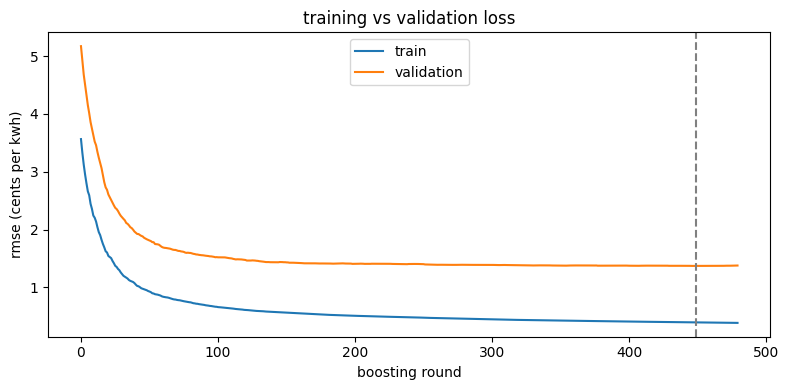
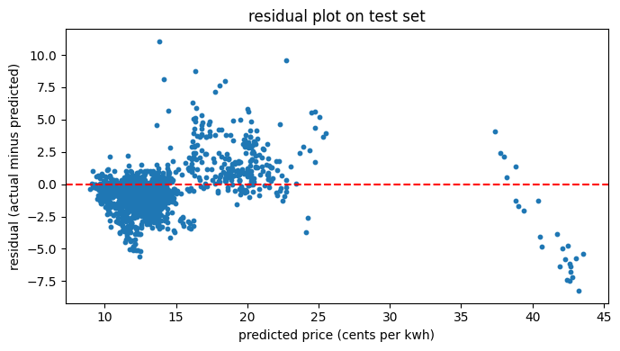
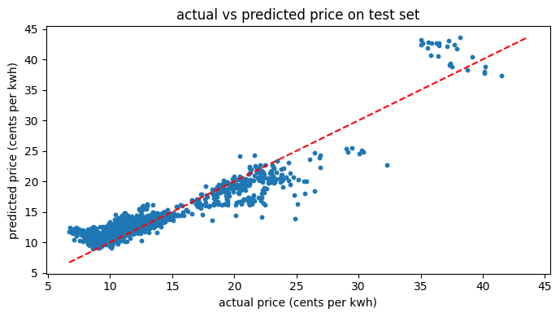
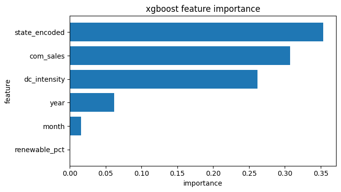
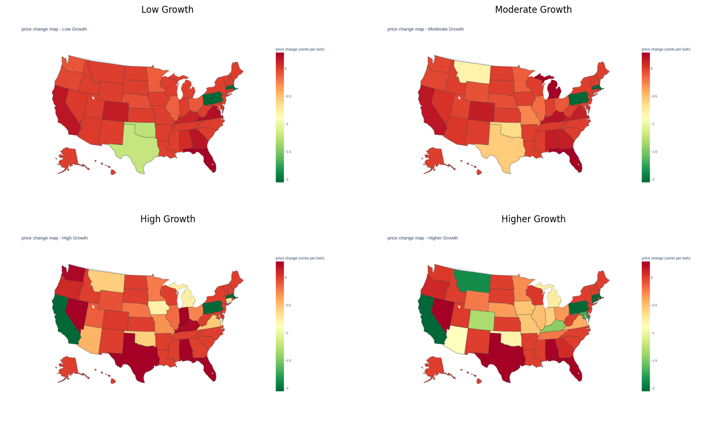
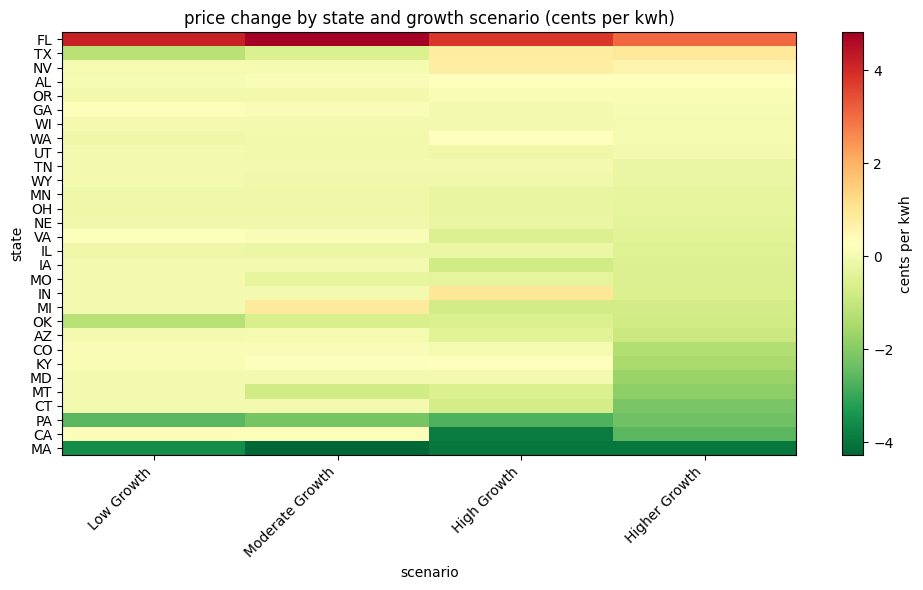

# Project Pipeline

### Executive summary:
- This project aims to predict the rise in electricity prices of states given the projected growth of data centers within those regions
- The projected growth made by im3 can be separated into several categories:
  - low growth
  - moderate growth
  - high growth
  - higher growth
- Each growth category is also accompanied by a percentage of market gravity (25%, 50%, 75%, 100%) which measures the spread of data centers within a state that they're projected to be added to.
- However, given the availability of data, we'll only be performing macro analysis for entire states across the US, hence the fact of market gravity will not be considered. 

## Importing Packages and Setting Up Logging


```python
import pandas as pd
import duckdb
import json
import glob
import os
import logging
import itertools
import numpy as np
import matplotlib.pyplot as plt
import plotly.express as px
from tqdm import tqdm
from xgboost import XGBRegressor
from sklearn.preprocessing import LabelEncoder
from sklearn.metrics import mean_squared_error, mean_absolute_error, r2_score

os.makedirs('../logs', exist_ok=True)
logging.basicConfig(
    filename='../logs/pipeline.log',
    level=logging.INFO,
    format='%(asctime)s %(levelname)s %(message)s'
)
logging.info('pipeline started')
print('setup complete')
```

    setup complete


## Load CSV tables into DuckDB
- This project utilizes five tables in total: 
  - EIA Retail Sales (Sales and Pricing of Electricity)
  - EIA Renewable Generation (Amount of energy that is generated by electricity)
  - EIA total generation (Total amount of generated energy)
  - im3 Open Source data center atlas (existing data center locations across the U.S.)
  - im3 projected data center (projected data center growth numbers and locations across the U.S.)


```python
# connect to an in-memory duckdb database
con = duckdb.connect()

# load each csv file as a table so we can query it with sql
# wrapped in try/except so a missing or renamed file raises a clear error message
try:
    con.execute("CREATE TABLE retail_sales AS SELECT * FROM read_csv_auto('../data/eia_retail_sales_2015_2026.csv')")
    con.execute("CREATE TABLE renewable_gen AS SELECT * FROM read_csv_auto('../data/eia_renewable_generation_2015_2026.csv')")
    con.execute("CREATE TABLE total_gen AS SELECT * FROM read_csv_auto('../data/eia_total_generation_2015_2026.csv')")
    con.execute("CREATE TABLE dc_current AS SELECT * FROM read_csv_auto('../data/im3_open_source_data_center_atlas_v2026.02.09/im3_open_source_data_center_atlas_v2026.02.09.csv')")
    logging.info('csv tables loaded into duckdb')
except Exception as e:
    logging.error(f'failed to load csv files into duckdb: {e}')
    raise

# print row counts so we can confirm each table loaded correctly
for table in ['retail_sales', 'renewable_gen', 'total_gen', 'dc_current']:
    count = con.execute(f"SELECT COUNT(*) FROM {table}").fetchone()[0]
    print(f'{table}: {count:,} rows')
```

    retail_sales: 49,476 rows
    renewable_gen: 179,652 rows
    total_gen: 194,055 rows
    dc_current: 1,479 rows


## Load All Projected Data Center Growth Scenario in GeoJSON files
- reads the four geojson files (one per growth scenario) and converts them into a flat dataframe and import into duckdb table


```python
# the geojson files use full lowercase state names, so we need a lookup to convert them to abbreviations
STATE_MAP = {
    'alabama':'AL','alaska':'AK','arizona':'AZ','arkansas':'AR','california':'CA',
    'colorado':'CO','connecticut':'CT','delaware':'DE','florida':'FL','georgia':'GA',
    'hawaii':'HI','idaho':'ID','illinois':'IL','indiana':'IN','iowa':'IA',
    'kansas':'KS','kentucky':'KY','louisiana':'LA','maine':'ME','maryland':'MD',
    'massachusetts':'MA','michigan':'MI','minnesota':'MN','mississippi':'MS','missouri':'MO',
    'montana':'MT','nebraska':'NE','nevada':'NV','new hampshire':'NH','new jersey':'NJ',
    'new mexico':'NM','new york':'NY','north carolina':'NC','north dakota':'ND','ohio':'OH',
    'oklahoma':'OK','oregon':'OR','pennsylvania':'PA','rhode island':'RI','south carolina':'SC',
    'south dakota':'SD','tennessee':'TN','texas':'TX','utah':'UT','vermont':'VT',
    'virginia':'VA','washington':'WA','west virginia':'WV','wisconsin':'WI','wyoming':'WY'
}

# the dataset has 5 market gravity weights but they all produce the same state-level mw totals
# gravity only affects which county within a state gets each data center, not the state total
# so we just load the 50 percent gravity files, one per growth scenario
geojson_files = glob.glob('../data/im3_projected_data_centers_v1.1/**/*.geojson', recursive=True)
geojson_files = [f for f in geojson_files if '_50_market_gravity' in f]

records = []
# wrapped in try/except so a corrupted or missing geojson file raises a clear error
try:
    for filepath in geojson_files:
        with open(filepath) as f:
            data = json.load(f)
        for feature in data['features']:
            p = feature['properties']
            records.append({
                'growth_scenario': p['growth_scenario'],
                'state_abb':       STATE_MAP.get(p['region'].lower()),
                'dc_mw':           p['data_center_it_power_mw'],
                'sqft':            p['campus_size_square_ft']
            })
    dc_projected = pd.DataFrame(records)
    con.register('dc_projected', dc_projected)
except Exception as e:
    logging.error(f'failed to load geojson files: {e}')
    raise

logging.info(f'loaded dc_projected with {len(dc_projected)} rows')
print(f'projected dc table: {len(dc_projected):,} rows')
print(dc_projected.groupby('growth_scenario').size().reset_index(name='dc_count'))
```

    projected dc table: 3,329 rows
      growth_scenario  dc_count
    0            high       909
    1          higher      1870
    2             low       222
    3        moderate       328


## Querying the current Data Center Power Consumption per state
- by using the industry standard of per 10,000 square feet consumes 1 MegaWatts


```python
# estimate current dc capacity per state using the industry standard of 1 mw per 10,000 sqft
dc_by_state = con.execute("""
    SELECT
        state_abb,
        COUNT(*)              AS dc_count,
        SUM(sqft)             AS total_sqft,
        SUM(sqft / 10000.0)   AS current_dc_mw
    FROM dc_current
    WHERE state_abb IS NOT NULL
    GROUP BY state_abb
    ORDER BY current_dc_mw DESC
""").df()

logging.info(f'dc_by_state: {len(dc_by_state)} states')
print('top 10 states by current dc capacity (mw):')
print(dc_by_state.head(10).to_string(index=False))
```

    top 10 states by current dc capacity (mw):
    state_abb  dc_count  total_sqft  current_dc_mw
           OH        93 102289862.0     10228.9862
           VA       319  98744082.0      9874.4082
           IA        64  59716157.0      5971.6157
           OR       109  53124693.0      5312.4693
           TN        22  50601005.0      5060.1005
           NE        26  47178110.0      4717.8110
           AZ        65  43493083.0      4349.3083
           TX       127  40212187.0      4021.2187
           WA        82  35289624.0      3528.9624
           MO        16  28530739.0      2853.0739


## Build the training dataset
- joining together the three eia datasets
- `renewable_pct`: all renewable energy generated / total energy generated for that state and month


```python
# build the main training table by joining three eia datasets
# for each state and month we get: commercial price, commercial sales, and renewable share
# renewable_pct = all renewables generation / total generation for that state and month
training_df = con.execute("""
    SELECT
        r.period,
        r.stateid AS state_abb,
        r.price AS com_price,
        r.sales AS com_sales,
        COALESCE(ren.generation / NULLIF(tot.generation, 0), 0) AS renewable_pct
    FROM retail_sales r
    LEFT JOIN renewable_gen ren
        ON r.stateid = ren.location
        AND r.period = ren.period
        AND ren.fueltypeid = 'AOR'
        AND ren.sectorid = 99
    LEFT JOIN total_gen tot
        ON r.stateid = tot.location
        AND r.period = tot.period
        AND tot.fueltypeid = 'ALL'
        AND tot.sectorid = 99
    WHERE r.sectorid = 'COM'
      AND LENGTH(r.stateid) = 2
      AND r.price IS NOT NULL
      AND r.price > 0
    ORDER BY r.stateid, r.period
""").df()

logging.info(f'training table: {len(training_df)} rows')
print(f'{len(training_df):,} rows, {training_df["state_abb"].nunique()} states, {training_df["period"].min()} to {training_df["period"].max()}')
training_df.head()
```

    6,916 rows, 52 states, 2015-01 to 2026-01


<div>
<style scoped>
    .dataframe tbody tr th:only-of-type {
        vertical-align: middle;
    }

    .dataframe tbody tr th {
        vertical-align: top;
    }

    .dataframe thead th {
        text-align: right;
    }
</style>
<table border="1" class="dataframe">
  <thead>
    <tr style="text-align: right;">
      <th></th>
      <th>period</th>
      <th>state_abb</th>
      <th>com_price</th>
      <th>com_sales</th>
      <th>renewable_pct</th>
    </tr>
  </thead>
  <tbody>
    <tr>
      <th>0</th>
      <td>2015-01</td>
      <td>AK</td>
      <td>16.88</td>
      <td>250.60023</td>
      <td>0.0</td>
    </tr>
    <tr>
      <th>1</th>
      <td>2015-02</td>
      <td>AK</td>
      <td>16.98</td>
      <td>241.10219</td>
      <td>0.0</td>
    </tr>
    <tr>
      <th>2</th>
      <td>2015-03</td>
      <td>AK</td>
      <td>17.23</td>
      <td>237.44299</td>
      <td>0.0</td>
    </tr>
    <tr>
      <th>3</th>
      <td>2015-04</td>
      <td>AK</td>
      <td>17.10</td>
      <td>225.00938</td>
      <td>0.0</td>
    </tr>
    <tr>
      <th>4</th>
      <td>2015-05</td>
      <td>AK</td>
      <td>17.87</td>
      <td>214.35693</td>
      <td>0.0</td>
    </tr>
  </tbody>
</table>
</div>


## Querying projected Data Center energy consumption per state per growth scenario

- sums up all data centers per state and estimates their energy consumption by using the industry standard equation of **1 MegaWatt per 10,000 sqft**.
- measure data center consumption per growth scenario
- This industry rule comes form the *LBNL 2024 Industry Report*, which technically measures the average power density of a U.S. data center. 


```python
# sum projected dc capacity per state per growth scenario
projected_by_state = con.execute("""
    SELECT
        growth_scenario,
        state_abb,
        COUNT(*) AS projected_dc_count,
        SUM(dc_mw) AS projected_dc_mw
    FROM dc_projected
    WHERE state_abb IS NOT NULL
    GROUP BY growth_scenario, state_abb
    ORDER BY growth_scenario, projected_dc_mw DESC
""").df()

logging.info(f'projected_by_state: {len(projected_by_state)} rows')
print(f'{len(projected_by_state):,} rows, {projected_by_state["growth_scenario"].nunique()} scenarios')
projected_by_state[projected_by_state['state_abb'] == 'VA']
```

    109 rows, 4 scenarios


<div>
<style scoped>
    .dataframe tbody tr th:only-of-type {
        vertical-align: middle;
    }

    .dataframe tbody tr th {
        vertical-align: top;
    }

    .dataframe thead th {
        text-align: right;
    }
</style>
<table border="1" class="dataframe">
  <thead>
    <tr style="text-align: right;">
      <th></th>
      <th>growth_scenario</th>
      <th>state_abb</th>
      <th>projected_dc_count</th>
      <th>projected_dc_mw</th>
    </tr>
  </thead>
  <tbody>
    <tr>
      <th>0</th>
      <td>high</td>
      <td>VA</td>
      <td>206</td>
      <td>7416.0</td>
    </tr>
    <tr>
      <th>28</th>
      <td>higher</td>
      <td>VA</td>
      <td>420</td>
      <td>15120.0</td>
    </tr>
    <tr>
      <th>59</th>
      <td>low</td>
      <td>VA</td>
      <td>52</td>
      <td>1872.0</td>
    </tr>
    <tr>
      <th>83</th>
      <td>moderate</td>
      <td>VA</td>
      <td>76</td>
      <td>2736.0</td>
    </tr>
  </tbody>
</table>
</div>


## Feature Engineering

prepares the training table for the model by computing three derived columns:
- `dc_intensity`: current dc electricity consumption divided by commercial sales, normalizing dc load by state size so small and large states are comparable
- `month` and `year`: extracted from the period string so the model can learn seasonal and long-run price trends
- `state_encoded`: each state converted to a unique number so xgboost can learn each state's baseline price level. states differ structurally in fuel mix, regulation, and grid infrastructure, so including this lets the model separate those structural differences from the dc growth signal


```python
# join dc capacity into the training table
df = training_df.merge(dc_by_state[['state_abb', 'current_dc_mw']], on='state_abb', how='left')
df['current_dc_mw'] = df['current_dc_mw'].fillna(0)

# dc intensity: dc electricity consumption relative to commercial sales
# dividing by com_sales normalizes for state size so a 1000 mw dc cluster means the same thing in texas and rhode island
df['dc_intensity'] = df['current_dc_mw'] / df['com_sales']
df['dc_intensity'] = df['dc_intensity'].fillna(0)

# extract month and year from the period column for use as model features
df['month'] = pd.to_datetime(df['period']).dt.month
df['year'] = pd.to_datetime(df['period']).dt.year

# encode each state as a unique integer so xgboost can learn state-level baseline prices
# states differ in regulation, fuel mix, and grid structure, which drives most of the price variation
le = LabelEncoder()
df['state_encoded'] = le.fit_transform(df['state_abb'])

print(f'final training dataframe shape: {df.shape}')
print(f'dc_intensity range: {df["dc_intensity"].min():.4f} to {df["dc_intensity"].max():.4f}')
print(f'price range: {df["com_price"].min():.2f} to {df["com_price"].max():.2f} cents per kwh')
df.head()
```

    final training dataframe shape: (6916, 10)
    dc_intensity range: 0.0000 to 9.3744
    price range: 6.43 to 43.25 cents per kwh


<div>
<style scoped>
    .dataframe tbody tr th:only-of-type {
        vertical-align: middle;
    }

    .dataframe tbody tr th {
        vertical-align: top;
    }

    .dataframe thead th {
        text-align: right;
    }
</style>
<table border="1" class="dataframe">
  <thead>
    <tr style="text-align: right;">
      <th></th>
      <th>period</th>
      <th>state_abb</th>
      <th>com_price</th>
      <th>com_sales</th>
      <th>renewable_pct</th>
      <th>current_dc_mw</th>
      <th>dc_intensity</th>
      <th>month</th>
      <th>year</th>
      <th>state_encoded</th>
    </tr>
  </thead>
  <tbody>
    <tr>
      <th>0</th>
      <td>2015-01</td>
      <td>AK</td>
      <td>16.88</td>
      <td>250.60023</td>
      <td>0.0</td>
      <td>0.0</td>
      <td>0.0</td>
      <td>1</td>
      <td>2015</td>
      <td>0</td>
    </tr>
    <tr>
      <th>1</th>
      <td>2015-02</td>
      <td>AK</td>
      <td>16.98</td>
      <td>241.10219</td>
      <td>0.0</td>
      <td>0.0</td>
      <td>0.0</td>
      <td>2</td>
      <td>2015</td>
      <td>0</td>
    </tr>
    <tr>
      <th>2</th>
      <td>2015-03</td>
      <td>AK</td>
      <td>17.23</td>
      <td>237.44299</td>
      <td>0.0</td>
      <td>0.0</td>
      <td>0.0</td>
      <td>3</td>
      <td>2015</td>
      <td>0</td>
    </tr>
    <tr>
      <th>3</th>
      <td>2015-04</td>
      <td>AK</td>
      <td>17.10</td>
      <td>225.00938</td>
      <td>0.0</td>
      <td>0.0</td>
      <td>0.0</td>
      <td>4</td>
      <td>2015</td>
      <td>0</td>
    </tr>
    <tr>
      <th>4</th>
      <td>2015-05</td>
      <td>AK</td>
      <td>17.87</td>
      <td>214.35693</td>
      <td>0.0</td>
      <td>0.0</td>
      <td>0.0</td>
      <td>5</td>
      <td>2015</td>
      <td>0</td>
    </tr>
  </tbody>
</table>
</div>


## Grid Search and Model Training

the model uses six features to predict commercial electricity price:
- `com_sales`: how much commercial electricity the state consumed that month (million kwh). represents the size and activity level of the commercial sector
- `renewable_pct`: fraction of the state's total generation that came from renewables that month. states with cheap hydro or wind tend to have lower prices
- `dc_intensity`: current dc electricity consumption (mw) divided by com_sales. measures how large dc load is relative to the state's commercial grid
- `month`: month number 1 to 12, captures seasonal price swings from summer cooling and winter heating
- `year`: the calendar year, captures the long-run upward trend in electricity prices over time
- `state_encoded`: each state encoded as a unique integer. this lets the model learn each state's structural baseline price, which varies due to regulation, fuel mix, and grid infrastructure. without this feature, the model cannot distinguish hawaii at 28 cents from louisiana at 7 cents

grid search tries every combination of hyperparameters listed below and picks whichever set produces the lowest validation rmse.


```python
import itertools
from tqdm import tqdm

FEATURES = ['com_sales', 'renewable_pct', 'dc_intensity', 'month', 'year', 'state_encoded']
TARGET = 'com_price'

# split by year so the model never sees future data during training
# 2022 was an energy crisis year with unusual price spikes unrelated to dc growth
# including it in training helps the model learn that pattern rather than be surprised by it
train = df[df['year'] <= 2022]
val = df[df['year'] == 2023]
test = df[df['year'] >= 2024]

X_train, y_train = train[FEATURES], train[TARGET]
X_val, y_val = val[FEATURES],   val[TARGET]
X_test, y_test = test[FEATURES],  test[TARGET]

print(f'train: {len(train):,} rows (2015 to 2022)')
print(f'val: {len(val):,} rows (2023)')
print(f'test: {len(test):,} rows (2024 to 2026)')

# define the parameter values to search over
# itertools.product generates every possible combination of these values
# reg_alpha (l1) and reg_lambda (l2) add regularization penalties that reduce overfitting
# reg_alpha (l1) and reg_lambda (l2) add regularization penalties that reduce overfitting
# min_child_weight controls the minimum number of samples needed in a leaf node
# higher values force more conservative splits and reduce overfitting
param_grid = {
    'max_depth':  [3, 4],
    'learning_rate': [0.05, 0.1],
    'subsample': [0.7, 0.8],
    'colsample_bytree': [0.7, 0.8],
    'reg_alpha': [0, 0.1],
    'min_child_weight': [5, 20, 50]
}

keys = list(param_grid.keys())
values = list(param_grid.values())
all_combos = list(itertools.product(*values))

best_rmse = float('inf')
best_params = {}
results = []

# loop over all combinations and print progress manually
for i, combo in enumerate(all_combos):
    params = dict(zip(keys, combo))
    print(f'model {i+1}/{len(all_combos)}: {params}', flush=True)

    candidate = XGBRegressor(
        n_estimators=200,
        early_stopping_rounds=15,
        random_state=42,
        verbosity=0,
        nthread=4,
        **params
    )
    candidate.fit(X_train, y_train, eval_set=[(X_val, y_val)], verbose=False)

    val_pred = candidate.predict(X_val)
    val_rmse = np.sqrt(mean_squared_error(y_val, val_pred))

    results.append({**params, 'val_rmse': round(val_rmse, 4)})

    if val_rmse < best_rmse:
        best_rmse = val_rmse
        best_params = params.copy()

print(f'\nbest val rmse: {best_rmse:.4f}')
print(f'best params: {best_params}')

# show all combinations sorted by validation rmse
results_df = pd.DataFrame(results).sort_values('val_rmse').reset_index(drop=True)
print('\nall combinations (sorted best to worst):')
print(results_df.to_string(index=False))

```

    train: 4,992 rows (2015 to 2022)
    val: 624 rows (2023)
    test: 1,300 rows (2024 to 2026)
    model 1/96: {'max_depth': 3, 'learning_rate': 0.05, 'subsample': 0.7, 'colsample_bytree': 0.7, 'reg_alpha': 0, 'min_child_weight': 5}


    model 2/96: {'max_depth': 3, 'learning_rate': 0.05, 'subsample': 0.7, 'colsample_bytree': 0.7, 'reg_alpha': 0, 'min_child_weight': 20}
    model 3/96: {'max_depth': 3, 'learning_rate': 0.05, 'subsample': 0.7, 'colsample_bytree': 0.7, 'reg_alpha': 0, 'min_child_weight': 50}
    model 4/96: {'max_depth': 3, 'learning_rate': 0.05, 'subsample': 0.7, 'colsample_bytree': 0.7, 'reg_alpha': 0.1, 'min_child_weight': 5}
    model 5/96: {'max_depth': 3, 'learning_rate': 0.05, 'subsample': 0.7, 'colsample_bytree': 0.7, 'reg_alpha': 0.1, 'min_child_weight': 20}
    model 6/96: {'max_depth': 3, 'learning_rate': 0.05, 'subsample': 0.7, 'colsample_bytree': 0.7, 'reg_alpha': 0.1, 'min_child_weight': 50}
    model 7/96: {'max_depth': 3, 'learning_rate': 0.05, 'subsample': 0.7, 'colsample_bytree': 0.8, 'reg_alpha': 0, 'min_child_weight': 5}
    model 8/96: {'max_depth': 3, 'learning_rate': 0.05, 'subsample': 0.7, 'colsample_bytree': 0.8, 'reg_alpha': 0, 'min_child_weight': 20}
    model 9/96: {'max_depth': 3, 'learning_rate': 0.05, 'subsample': 0.7, 'colsample_bytree': 0.8, 'reg_alpha': 0, 'min_child_weight': 50}
    model 10/96: {'max_depth': 3, 'learning_rate': 0.05, 'subsample': 0.7, 'colsample_bytree': 0.8, 'reg_alpha': 0.1, 'min_child_weight': 5}
    model 11/96: {'max_depth': 3, 'learning_rate': 0.05, 'subsample': 0.7, 'colsample_bytree': 0.8, 'reg_alpha': 0.1, 'min_child_weight': 20}
    model 12/96: {'max_depth': 3, 'learning_rate': 0.05, 'subsample': 0.7, 'colsample_bytree': 0.8, 'reg_alpha': 0.1, 'min_child_weight': 50}
    model 13/96: {'max_depth': 3, 'learning_rate': 0.05, 'subsample': 0.8, 'colsample_bytree': 0.7, 'reg_alpha': 0, 'min_child_weight': 5}
    model 14/96: {'max_depth': 3, 'learning_rate': 0.05, 'subsample': 0.8, 'colsample_bytree': 0.7, 'reg_alpha': 0, 'min_child_weight': 20}
    model 15/96: {'max_depth': 3, 'learning_rate': 0.05, 'subsample': 0.8, 'colsample_bytree': 0.7, 'reg_alpha': 0, 'min_child_weight': 50}
    model 16/96: {'max_depth': 3, 'learning_rate': 0.05, 'subsample': 0.8, 'colsample_bytree': 0.7, 'reg_alpha': 0.1, 'min_child_weight': 5}
    model 17/96: {'max_depth': 3, 'learning_rate': 0.05, 'subsample': 0.8, 'colsample_bytree': 0.7, 'reg_alpha': 0.1, 'min_child_weight': 20}
    model 18/96: {'max_depth': 3, 'learning_rate': 0.05, 'subsample': 0.8, 'colsample_bytree': 0.7, 'reg_alpha': 0.1, 'min_child_weight': 50}
    model 19/96: {'max_depth': 3, 'learning_rate': 0.05, 'subsample': 0.8, 'colsample_bytree': 0.8, 'reg_alpha': 0, 'min_child_weight': 5}
    model 20/96: {'max_depth': 3, 'learning_rate': 0.05, 'subsample': 0.8, 'colsample_bytree': 0.8, 'reg_alpha': 0, 'min_child_weight': 20}
    model 21/96: {'max_depth': 3, 'learning_rate': 0.05, 'subsample': 0.8, 'colsample_bytree': 0.8, 'reg_alpha': 0, 'min_child_weight': 50}
    model 22/96: {'max_depth': 3, 'learning_rate': 0.05, 'subsample': 0.8, 'colsample_bytree': 0.8, 'reg_alpha': 0.1, 'min_child_weight': 5}
    model 23/96: {'max_depth': 3, 'learning_rate': 0.05, 'subsample': 0.8, 'colsample_bytree': 0.8, 'reg_alpha': 0.1, 'min_child_weight': 20}
    model 24/96: {'max_depth': 3, 'learning_rate': 0.05, 'subsample': 0.8, 'colsample_bytree': 0.8, 'reg_alpha': 0.1, 'min_child_weight': 50}
    model 25/96: {'max_depth': 3, 'learning_rate': 0.1, 'subsample': 0.7, 'colsample_bytree': 0.7, 'reg_alpha': 0, 'min_child_weight': 5}
    model 26/96: {'max_depth': 3, 'learning_rate': 0.1, 'subsample': 0.7, 'colsample_bytree': 0.7, 'reg_alpha': 0, 'min_child_weight': 20}
    model 27/96: {'max_depth': 3, 'learning_rate': 0.1, 'subsample': 0.7, 'colsample_bytree': 0.7, 'reg_alpha': 0, 'min_child_weight': 50}
    model 28/96: {'max_depth': 3, 'learning_rate': 0.1, 'subsample': 0.7, 'colsample_bytree': 0.7, 'reg_alpha': 0.1, 'min_child_weight': 5}
    model 29/96: {'max_depth': 3, 'learning_rate': 0.1, 'subsample': 0.7, 'colsample_bytree': 0.7, 'reg_alpha': 0.1, 'min_child_weight': 20}
    model 30/96: {'max_depth': 3, 'learning_rate': 0.1, 'subsample': 0.7, 'colsample_bytree': 0.7, 'reg_alpha': 0.1, 'min_child_weight': 50}
    model 31/96: {'max_depth': 3, 'learning_rate': 0.1, 'subsample': 0.7, 'colsample_bytree': 0.8, 'reg_alpha': 0, 'min_child_weight': 5}
    model 32/96: {'max_depth': 3, 'learning_rate': 0.1, 'subsample': 0.7, 'colsample_bytree': 0.8, 'reg_alpha': 0, 'min_child_weight': 20}
    model 33/96: {'max_depth': 3, 'learning_rate': 0.1, 'subsample': 0.7, 'colsample_bytree': 0.8, 'reg_alpha': 0, 'min_child_weight': 50}
    model 34/96: {'max_depth': 3, 'learning_rate': 0.1, 'subsample': 0.7, 'colsample_bytree': 0.8, 'reg_alpha': 0.1, 'min_child_weight': 5}
    model 35/96: {'max_depth': 3, 'learning_rate': 0.1, 'subsample': 0.7, 'colsample_bytree': 0.8, 'reg_alpha': 0.1, 'min_child_weight': 20}
    model 36/96: {'max_depth': 3, 'learning_rate': 0.1, 'subsample': 0.7, 'colsample_bytree': 0.8, 'reg_alpha': 0.1, 'min_child_weight': 50}
    model 37/96: {'max_depth': 3, 'learning_rate': 0.1, 'subsample': 0.8, 'colsample_bytree': 0.7, 'reg_alpha': 0, 'min_child_weight': 5}
    model 38/96: {'max_depth': 3, 'learning_rate': 0.1, 'subsample': 0.8, 'colsample_bytree': 0.7, 'reg_alpha': 0, 'min_child_weight': 20}
    model 39/96: {'max_depth': 3, 'learning_rate': 0.1, 'subsample': 0.8, 'colsample_bytree': 0.7, 'reg_alpha': 0, 'min_child_weight': 50}
    model 40/96: {'max_depth': 3, 'learning_rate': 0.1, 'subsample': 0.8, 'colsample_bytree': 0.7, 'reg_alpha': 0.1, 'min_child_weight': 5}
    model 41/96: {'max_depth': 3, 'learning_rate': 0.1, 'subsample': 0.8, 'colsample_bytree': 0.7, 'reg_alpha': 0.1, 'min_child_weight': 20}
    model 42/96: {'max_depth': 3, 'learning_rate': 0.1, 'subsample': 0.8, 'colsample_bytree': 0.7, 'reg_alpha': 0.1, 'min_child_weight': 50}
    model 43/96: {'max_depth': 3, 'learning_rate': 0.1, 'subsample': 0.8, 'colsample_bytree': 0.8, 'reg_alpha': 0, 'min_child_weight': 5}
    model 44/96: {'max_depth': 3, 'learning_rate': 0.1, 'subsample': 0.8, 'colsample_bytree': 0.8, 'reg_alpha': 0, 'min_child_weight': 20}
    model 45/96: {'max_depth': 3, 'learning_rate': 0.1, 'subsample': 0.8, 'colsample_bytree': 0.8, 'reg_alpha': 0, 'min_child_weight': 50}
    model 46/96: {'max_depth': 3, 'learning_rate': 0.1, 'subsample': 0.8, 'colsample_bytree': 0.8, 'reg_alpha': 0.1, 'min_child_weight': 5}
    model 47/96: {'max_depth': 3, 'learning_rate': 0.1, 'subsample': 0.8, 'colsample_bytree': 0.8, 'reg_alpha': 0.1, 'min_child_weight': 20}
    model 48/96: {'max_depth': 3, 'learning_rate': 0.1, 'subsample': 0.8, 'colsample_bytree': 0.8, 'reg_alpha': 0.1, 'min_child_weight': 50}
    model 49/96: {'max_depth': 4, 'learning_rate': 0.05, 'subsample': 0.7, 'colsample_bytree': 0.7, 'reg_alpha': 0, 'min_child_weight': 5}
    model 50/96: {'max_depth': 4, 'learning_rate': 0.05, 'subsample': 0.7, 'colsample_bytree': 0.7, 'reg_alpha': 0, 'min_child_weight': 20}
    model 51/96: {'max_depth': 4, 'learning_rate': 0.05, 'subsample': 0.7, 'colsample_bytree': 0.7, 'reg_alpha': 0, 'min_child_weight': 50}
    model 52/96: {'max_depth': 4, 'learning_rate': 0.05, 'subsample': 0.7, 'colsample_bytree': 0.7, 'reg_alpha': 0.1, 'min_child_weight': 5}
    model 53/96: {'max_depth': 4, 'learning_rate': 0.05, 'subsample': 0.7, 'colsample_bytree': 0.7, 'reg_alpha': 0.1, 'min_child_weight': 20}
    model 54/96: {'max_depth': 4, 'learning_rate': 0.05, 'subsample': 0.7, 'colsample_bytree': 0.7, 'reg_alpha': 0.1, 'min_child_weight': 50}
    model 55/96: {'max_depth': 4, 'learning_rate': 0.05, 'subsample': 0.7, 'colsample_bytree': 0.8, 'reg_alpha': 0, 'min_child_weight': 5}
    model 56/96: {'max_depth': 4, 'learning_rate': 0.05, 'subsample': 0.7, 'colsample_bytree': 0.8, 'reg_alpha': 0, 'min_child_weight': 20}
    model 57/96: {'max_depth': 4, 'learning_rate': 0.05, 'subsample': 0.7, 'colsample_bytree': 0.8, 'reg_alpha': 0, 'min_child_weight': 50}
    model 58/96: {'max_depth': 4, 'learning_rate': 0.05, 'subsample': 0.7, 'colsample_bytree': 0.8, 'reg_alpha': 0.1, 'min_child_weight': 5}
    model 59/96: {'max_depth': 4, 'learning_rate': 0.05, 'subsample': 0.7, 'colsample_bytree': 0.8, 'reg_alpha': 0.1, 'min_child_weight': 20}
    model 60/96: {'max_depth': 4, 'learning_rate': 0.05, 'subsample': 0.7, 'colsample_bytree': 0.8, 'reg_alpha': 0.1, 'min_child_weight': 50}
    model 61/96: {'max_depth': 4, 'learning_rate': 0.05, 'subsample': 0.8, 'colsample_bytree': 0.7, 'reg_alpha': 0, 'min_child_weight': 5}
    model 62/96: {'max_depth': 4, 'learning_rate': 0.05, 'subsample': 0.8, 'colsample_bytree': 0.7, 'reg_alpha': 0, 'min_child_weight': 20}
    model 63/96: {'max_depth': 4, 'learning_rate': 0.05, 'subsample': 0.8, 'colsample_bytree': 0.7, 'reg_alpha': 0, 'min_child_weight': 50}
    model 64/96: {'max_depth': 4, 'learning_rate': 0.05, 'subsample': 0.8, 'colsample_bytree': 0.7, 'reg_alpha': 0.1, 'min_child_weight': 5}
    model 65/96: {'max_depth': 4, 'learning_rate': 0.05, 'subsample': 0.8, 'colsample_bytree': 0.7, 'reg_alpha': 0.1, 'min_child_weight': 20}
    model 66/96: {'max_depth': 4, 'learning_rate': 0.05, 'subsample': 0.8, 'colsample_bytree': 0.7, 'reg_alpha': 0.1, 'min_child_weight': 50}
    model 67/96: {'max_depth': 4, 'learning_rate': 0.05, 'subsample': 0.8, 'colsample_bytree': 0.8, 'reg_alpha': 0, 'min_child_weight': 5}
    model 68/96: {'max_depth': 4, 'learning_rate': 0.05, 'subsample': 0.8, 'colsample_bytree': 0.8, 'reg_alpha': 0, 'min_child_weight': 20}
    model 69/96: {'max_depth': 4, 'learning_rate': 0.05, 'subsample': 0.8, 'colsample_bytree': 0.8, 'reg_alpha': 0, 'min_child_weight': 50}
    model 70/96: {'max_depth': 4, 'learning_rate': 0.05, 'subsample': 0.8, 'colsample_bytree': 0.8, 'reg_alpha': 0.1, 'min_child_weight': 5}
    model 71/96: {'max_depth': 4, 'learning_rate': 0.05, 'subsample': 0.8, 'colsample_bytree': 0.8, 'reg_alpha': 0.1, 'min_child_weight': 20}
    model 72/96: {'max_depth': 4, 'learning_rate': 0.05, 'subsample': 0.8, 'colsample_bytree': 0.8, 'reg_alpha': 0.1, 'min_child_weight': 50}
    model 73/96: {'max_depth': 4, 'learning_rate': 0.1, 'subsample': 0.7, 'colsample_bytree': 0.7, 'reg_alpha': 0, 'min_child_weight': 5}
    model 74/96: {'max_depth': 4, 'learning_rate': 0.1, 'subsample': 0.7, 'colsample_bytree': 0.7, 'reg_alpha': 0, 'min_child_weight': 20}
    model 75/96: {'max_depth': 4, 'learning_rate': 0.1, 'subsample': 0.7, 'colsample_bytree': 0.7, 'reg_alpha': 0, 'min_child_weight': 50}
    model 76/96: {'max_depth': 4, 'learning_rate': 0.1, 'subsample': 0.7, 'colsample_bytree': 0.7, 'reg_alpha': 0.1, 'min_child_weight': 5}
    model 77/96: {'max_depth': 4, 'learning_rate': 0.1, 'subsample': 0.7, 'colsample_bytree': 0.7, 'reg_alpha': 0.1, 'min_child_weight': 20}
    model 78/96: {'max_depth': 4, 'learning_rate': 0.1, 'subsample': 0.7, 'colsample_bytree': 0.7, 'reg_alpha': 0.1, 'min_child_weight': 50}
    model 79/96: {'max_depth': 4, 'learning_rate': 0.1, 'subsample': 0.7, 'colsample_bytree': 0.8, 'reg_alpha': 0, 'min_child_weight': 5}
    model 80/96: {'max_depth': 4, 'learning_rate': 0.1, 'subsample': 0.7, 'colsample_bytree': 0.8, 'reg_alpha': 0, 'min_child_weight': 20}
    model 81/96: {'max_depth': 4, 'learning_rate': 0.1, 'subsample': 0.7, 'colsample_bytree': 0.8, 'reg_alpha': 0, 'min_child_weight': 50}
    model 82/96: {'max_depth': 4, 'learning_rate': 0.1, 'subsample': 0.7, 'colsample_bytree': 0.8, 'reg_alpha': 0.1, 'min_child_weight': 5}
    model 83/96: {'max_depth': 4, 'learning_rate': 0.1, 'subsample': 0.7, 'colsample_bytree': 0.8, 'reg_alpha': 0.1, 'min_child_weight': 20}
    model 84/96: {'max_depth': 4, 'learning_rate': 0.1, 'subsample': 0.7, 'colsample_bytree': 0.8, 'reg_alpha': 0.1, 'min_child_weight': 50}
    model 85/96: {'max_depth': 4, 'learning_rate': 0.1, 'subsample': 0.8, 'colsample_bytree': 0.7, 'reg_alpha': 0, 'min_child_weight': 5}
    model 86/96: {'max_depth': 4, 'learning_rate': 0.1, 'subsample': 0.8, 'colsample_bytree': 0.7, 'reg_alpha': 0, 'min_child_weight': 20}
    model 87/96: {'max_depth': 4, 'learning_rate': 0.1, 'subsample': 0.8, 'colsample_bytree': 0.7, 'reg_alpha': 0, 'min_child_weight': 50}
    model 88/96: {'max_depth': 4, 'learning_rate': 0.1, 'subsample': 0.8, 'colsample_bytree': 0.7, 'reg_alpha': 0.1, 'min_child_weight': 5}
    model 89/96: {'max_depth': 4, 'learning_rate': 0.1, 'subsample': 0.8, 'colsample_bytree': 0.7, 'reg_alpha': 0.1, 'min_child_weight': 20}
    model 90/96: {'max_depth': 4, 'learning_rate': 0.1, 'subsample': 0.8, 'colsample_bytree': 0.7, 'reg_alpha': 0.1, 'min_child_weight': 50}
    model 91/96: {'max_depth': 4, 'learning_rate': 0.1, 'subsample': 0.8, 'colsample_bytree': 0.8, 'reg_alpha': 0, 'min_child_weight': 5}
    model 92/96: {'max_depth': 4, 'learning_rate': 0.1, 'subsample': 0.8, 'colsample_bytree': 0.8, 'reg_alpha': 0, 'min_child_weight': 20}
    model 93/96: {'max_depth': 4, 'learning_rate': 0.1, 'subsample': 0.8, 'colsample_bytree': 0.8, 'reg_alpha': 0, 'min_child_weight': 50}
    model 94/96: {'max_depth': 4, 'learning_rate': 0.1, 'subsample': 0.8, 'colsample_bytree': 0.8, 'reg_alpha': 0.1, 'min_child_weight': 5}
    model 95/96: {'max_depth': 4, 'learning_rate': 0.1, 'subsample': 0.8, 'colsample_bytree': 0.8, 'reg_alpha': 0.1, 'min_child_weight': 20}
    model 96/96: {'max_depth': 4, 'learning_rate': 0.1, 'subsample': 0.8, 'colsample_bytree': 0.8, 'reg_alpha': 0.1, 'min_child_weight': 50}
    
    best val rmse: 1.4071
    best params: {'max_depth': 4, 'learning_rate': 0.1, 'subsample': 0.7, 'colsample_bytree': 0.7, 'reg_alpha': 0, 'min_child_weight': 5}
    
    all combinations (sorted best to worst):
     max_depth  learning_rate  subsample  colsample_bytree  reg_alpha  min_child_weight  val_rmse
             4           0.10        0.7               0.7        0.0                 5    1.4071
             4           0.10        0.7               0.8        0.0                 5    1.4071
             4           0.10        0.8               0.7        0.1                 5    1.4087
             4           0.10        0.8               0.8        0.1                 5    1.4087
             4           0.10        0.7               0.8        0.1                 5    1.4140
             4           0.10        0.7               0.7        0.1                 5    1.4140
             4           0.10        0.8               0.8        0.0                 5    1.4281
             4           0.10        0.8               0.7        0.0                 5    1.4281
             4           0.10        0.7               0.7        0.0                20    1.4486
             4           0.10        0.7               0.8        0.0                20    1.4486
             4           0.10        0.8               0.7        0.1                20    1.4645
             4           0.10        0.8               0.8        0.1                20    1.4645
             4           0.10        0.7               0.7        0.1                20    1.4886
             4           0.10        0.7               0.8        0.1                20    1.4886
             4           0.10        0.8               0.8        0.0                20    1.4910
             4           0.10        0.8               0.7        0.0                20    1.4910
             4           0.05        0.7               0.7        0.0                 5    1.5136
             4           0.05        0.7               0.8        0.0                 5    1.5136
             4           0.05        0.7               0.7        0.1                 5    1.5248
             4           0.05        0.7               0.8        0.1                 5    1.5248
             4           0.05        0.8               0.7        0.0                 5    1.5272
             4           0.05        0.8               0.8        0.0                 5    1.5272
             4           0.05        0.8               0.8        0.1                 5    1.5301
             4           0.05        0.8               0.7        0.1                 5    1.5301
             4           0.05        0.8               0.7        0.0                20    1.5803
             4           0.05        0.8               0.8        0.0                20    1.5803
             4           0.05        0.8               0.7        0.1                20    1.5805
             4           0.05        0.8               0.8        0.1                20    1.5805
             4           0.10        0.8               0.8        0.1                50    1.5845
             4           0.10        0.8               0.7        0.1                50    1.5845
             4           0.10        0.7               0.7        0.0                50    1.5941
             4           0.10        0.7               0.8        0.0                50    1.5941
             3           0.10        0.8               0.8        0.0                20    1.5973
             3           0.10        0.8               0.7        0.0                20    1.5973
             4           0.05        0.7               0.8        0.1                20    1.5991
             4           0.05        0.7               0.7        0.1                20    1.5991
             3           0.10        0.8               0.8        0.1                20    1.6004
             3           0.10        0.8               0.7        0.1                20    1.6004
             4           0.10        0.7               0.8        0.1                50    1.6052
             4           0.10        0.7               0.7        0.1                50    1.6052
             4           0.05        0.7               0.7        0.0                20    1.6170
             4           0.05        0.7               0.8        0.0                20    1.6170
             4           0.10        0.8               0.7        0.0                50    1.6222
             4           0.10        0.8               0.8        0.0                50    1.6222
             3           0.10        0.7               0.8        0.0                 5    1.6233
             3           0.10        0.7               0.7        0.0                 5    1.6233
             3           0.10        0.8               0.7        0.0                 5    1.6441
             3           0.10        0.8               0.8        0.0                 5    1.6441
             3           0.10        0.8               0.8        0.1                 5    1.6461
             3           0.10        0.8               0.7        0.1                 5    1.6461
             3           0.10        0.7               0.7        0.0                20    1.6483
             3           0.10        0.7               0.8        0.0                20    1.6483
             3           0.10        0.7               0.8        0.1                20    1.6551
             3           0.10        0.7               0.7        0.1                20    1.6551
             3           0.10        0.7               0.8        0.1                 5    1.6563
             3           0.10        0.7               0.7        0.1                 5    1.6563
             3           0.10        0.8               0.8        0.0                50    1.7089
             3           0.10        0.8               0.7        0.0                50    1.7089
             3           0.10        0.8               0.8        0.1                50    1.7163
             3           0.10        0.8               0.7        0.1                50    1.7163
             3           0.10        0.7               0.8        0.0                50    1.7586
             3           0.10        0.7               0.7        0.0                50    1.7586
             3           0.10        0.7               0.8        0.1                50    1.7696
             3           0.10        0.7               0.7        0.1                50    1.7696
             4           0.05        0.7               0.7        0.1                50    1.7716
             4           0.05        0.7               0.8        0.1                50    1.7716
             4           0.05        0.7               0.7        0.0                50    1.7775
             4           0.05        0.7               0.8        0.0                50    1.7775
             4           0.05        0.8               0.7        0.0                50    1.7958
             4           0.05        0.8               0.8        0.0                50    1.7958
             4           0.05        0.8               0.7        0.1                50    1.7988
             4           0.05        0.8               0.8        0.1                50    1.7988
             3           0.05        0.7               0.7        0.0                 5    1.8887
             3           0.05        0.7               0.8        0.0                 5    1.8887
             3           0.05        0.8               0.7        0.0                 5    1.8887
             3           0.05        0.8               0.8        0.0                 5    1.8887
             3           0.05        0.8               0.8        0.1                 5    1.8905
             3           0.05        0.8               0.7        0.1                 5    1.8905
             3           0.05        0.7               0.7        0.1                 5    1.8952
             3           0.05        0.7               0.8        0.1                 5    1.8952
             3           0.05        0.8               0.7        0.1                20    1.9097
             3           0.05        0.8               0.8        0.1                20    1.9097
             3           0.05        0.8               0.8        0.0                20    1.9123
             3           0.05        0.8               0.7        0.0                20    1.9123
             3           0.05        0.7               0.7        0.0                20    1.9147
             3           0.05        0.7               0.8        0.0                20    1.9147
             3           0.05        0.7               0.8        0.1                20    1.9174
             3           0.05        0.7               0.7        0.1                20    1.9174
             3           0.05        0.7               0.7        0.0                50    1.9990
             3           0.05        0.7               0.8        0.0                50    1.9990
             3           0.05        0.7               0.7        0.1                50    1.9994
             3           0.05        0.7               0.8        0.1                50    1.9994
             3           0.05        0.8               0.7        0.0                50    2.0294
             3           0.05        0.8               0.8        0.0                50    2.0294
             3           0.05        0.8               0.8        0.1                50    2.0297
             3           0.05        0.8               0.7        0.1                50    2.0297


## Final Model Training and Loss Curve

trains the final model with the best parameters from grid search. the loss curve shows how training and validation rmse changed across every boosting round.


```python
model = XGBRegressor(
    n_estimators=500,
    early_stopping_rounds=30,
    random_state=42,
    verbosity=0,
    nthread=4,
    **best_params
)
model.fit(
    X_train, y_train,
    eval_set=[(X_train, y_train), (X_val, y_val)],
    verbose=False
)

train_loss = model.evals_result_['validation_0']['rmse']
val_loss = model.evals_result_['validation_1']['rmse']

print(f'best iteration: {model.best_iteration}')
print(f'final train rmse: {train_loss[model.best_iteration]:.4f}')
print(f'final val rmse:   {val_loss[model.best_iteration]:.4f}')

iterations = list(range(len(train_loss)))
loss_df = pd.DataFrame({
    'iteration': iterations + iterations,
    'rmse': train_loss + val_loss,
    'split': ['train'] * len(train_loss) + ['validation'] * len(val_loss)
})

fig_loss = px.line(
    loss_df,
    x='iteration',
    y='rmse',
    color='split',
    title='training vs validation loss (rmse per boosting round)',
    labels={'rmse': 'rmse (cents per kwh)', 'iteration': 'boosting round'}
)
fig_loss.add_vline(
    x=model.best_iteration,
    line_dash='dash',
    line_color='gray',
    annotation_text='best iteration'
)
fig_loss.write_html('../logs/loss_curve.html', include_plotlyjs='cdn')
fig_loss.show()

plt.figure(figsize=(8, 4))
plt.plot(iterations, train_loss, label='train')
plt.plot(iterations, val_loss, label='validation')
plt.axvline(model.best_iteration, color='gray', linestyle='--')
plt.title('training vs validation loss')
plt.xlabel('boosting round')
plt.ylabel('rmse (cents per kwh)')
plt.legend()
plt.tight_layout()
plt.show()

logging.info(f'final model trained: best iteration {model.best_iteration}')
```

    best iteration: 449
    final train rmse: 0.3939
    final val rmse:   1.3713


    

    


## Measuring Model Accuracy

evaluates the model on the validation set (2023), then on the held-out test set (2024 to 2026).

because xgboost is a tree model, it cannot extrapolate beyond the years it saw in training (2015 to 2022). for test years like 2024 or 2026, the model would treat them the same as 2022 and miss the continued price increase. to correct this:
- a linear trend is estimated from annual average prices in the training data (cents per kwh per year)
- for each test prediction, we add trend x years beyond 2022 to recover the missing price growth
- a small constant bias from the 75th percentile of validation residuals is added on top to correct any remaining level shift

also shows residual and actual vs predicted scatter plots.


```python
val_pred = model.predict(X_val)
val_rmse = np.sqrt(mean_squared_error(y_val, val_pred))
val_mae = mean_absolute_error(y_val, val_pred)
val_r2 = r2_score(y_val, val_pred)
val_mape = np.mean(np.abs((y_val - val_pred) / y_val)) * 100

print('validation set metrics (2023):')
print(f'rmse:{val_rmse:.4f} cents per kwh')
print(f'mae: {val_mae:.4f} cents per kwh')
print(f'r2: {val_r2:.4f}')
print(f'mape: {val_mape:.2f}%')

from sklearn.linear_model import LinearRegression

annual = train.groupby('year')[TARGET].mean().reset_index()
trend_model = LinearRegression().fit(annual[['year']], annual[TARGET])
trend_per_year = trend_model.coef_[0]
print(f'estimated annual price trend from training: {trend_per_year:+.4f} cents per kwh per year')

max_train_year = int(train['year'].max())

test_pred_raw = model.predict(X_test)
years_beyond = (X_test['year'] - max_train_year).clip(lower=0).values
test_pred = test_pred_raw + trend_per_year * years_beyond

val_residuals = y_val.values - model.predict(X_val)
bias = float(np.percentile(val_residuals, 75))
test_pred = test_pred + bias
print(f'bias correction (75th pct of val residuals): {bias:+.4f} cents per kwh')
logging.info(f'trend per year: {trend_per_year:.4f} | bias: {bias:.4f}')

test_rmse = np.sqrt(mean_squared_error(y_test, test_pred))
test_mae = mean_absolute_error(y_test, test_pred)
test_r2 = r2_score(y_test, test_pred)
test_mape = np.mean(np.abs((y_test - test_pred) / y_test)) * 100

baseline_rmse = np.sqrt(mean_squared_error(y_test, np.full(len(y_test), y_train.mean())))

print('test set metrics (2024 to 2026) with trend + bias correction:')
print(f'rmse: {test_rmse:.4f} cents per kwh')
print(f'mae: {test_mae:.4f} cents per kwh')
print(f'r2: {test_r2:.4f}')
print(f'mape: {test_mape:.2f}%')
print(f'baseline rmse (predict training mean): {baseline_rmse:.4f}')
print(f'improvement over baseline: {(baseline_rmse - test_rmse) / baseline_rmse * 100:.1f}%')

logging.info(f'val rmse: {val_rmse:.4f} | test rmse: {test_rmse:.4f} | baseline: {baseline_rmse:.4f}')

residuals = y_test.values - test_pred
fig_res = px.scatter(
    x=test_pred, y=residuals,
    labels={'x': 'predicted price (cents per kwh)', 'y': 'residual (actual minus predicted)'},
    title='residual plot on test set'
)
fig_res.add_hline(y=0, line_dash='dash', line_color='red')
fig_res.write_html('../logs/residual_plot.html', include_plotlyjs='cdn')
fig_res.show()

plt.figure(figsize=(7, 4))
plt.scatter(test_pred, residuals, s=10)
plt.axhline(0, color='red', linestyle='--')
plt.title('residual plot on test set')
plt.xlabel('predicted price (cents per kwh)')
plt.ylabel('residual (actual minus predicted)')
plt.tight_layout()
plt.show()

fig_ap = px.scatter(
    x=y_test, y=test_pred,
    labels={'x': 'actual price (cents per kwh)', 'y': 'predicted price (cents per kwh)'},
    title='actual vs predicted price on test set'
)
fig_ap.add_shape(
    type='line',
    x0=y_test.min(), y0=y_test.min(),
    x1=y_test.max(), y1=y_test.max(),
    line=dict(color='red', dash='dash')
)
fig_ap.write_html('../logs/actual_vs_predicted.html', include_plotlyjs='cdn')
fig_ap.show()

plt.figure(figsize=(7, 4))
plt.scatter(y_test, test_pred, s=10)
min_v = min(float(np.min(y_test)), float(np.min(test_pred)))
max_v = max(float(np.max(y_test)), float(np.max(test_pred)))
plt.plot([min_v, max_v], [min_v, max_v], 'r--')
plt.title('actual vs predicted price on test set')
plt.xlabel('actual price (cents per kwh)')
plt.ylabel('predicted price (cents per kwh)')
plt.tight_layout()
plt.show()
```

    validation set metrics (2023):
    rmse:1.3713 cents per kwh
    mae: 0.9669 cents per kwh
    r2: 0.9314
    mape: 7.43%
    estimated annual price trend from training: +0.2055 cents per kwh per year
    bias correction (75th pct of val residuals): +0.9085 cents per kwh
    test set metrics (2024 to 2026) with trend + bias correction:
    rmse: 2.0091 cents per kwh
    mae: 1.4593 cents per kwh
    r2: 0.8674
    mape: 11.58%
    baseline rmse (predict training mean): 6.0192
    improvement over baseline: 66.6%


    

    


    

    


## Plotting feature importance
- understand which features are more important in helping the model to make a decision


```python
importance_df = pd.DataFrame({
    'feature': FEATURES,
    'importance': model.feature_importances_
}).sort_values('importance', ascending=True)

fig = px.bar(
    importance_df,
    x='importance',
    y='feature',
    orientation='h',
    title='xgboost feature importance',
    color='importance',
    color_continuous_scale='Blues'
)
fig.update_layout(showlegend=False, height=350)
fig.write_html('../logs/feature_importance.html', include_plotlyjs='cdn')
fig.show()

plt.figure(figsize=(7, 4))
plt.barh(importance_df['feature'], importance_df['importance'])
plt.title('xgboost feature importance')
plt.xlabel('importance')
plt.ylabel('feature')
plt.tight_layout()
plt.show()
```


    

    


## Predicting price impact under 4 growth scenarios
- for each of the four growth scenarios, it takes the most recent year of the data as the starting point, looks up how many projected mw of new data centers each state would receive, and adds to the state's existing data center energy consumption.
- the only feature that changes between baseline and each scenario is dc_intensity. all other features stay fixed so the predicted price difference is driven purely by the change in data center load.
- the same trend correction and bias used on the test set are applied here so baseline and scenario predictions are on the same scale.


```python
# use the most recent year of data as the starting point for all predictions
baseline_year = df[df['year'] == df['year'].max()].copy()

# get the model's baseline prediction using current dc intensity, before any growth is added
X_baseline = baseline_year[FEATURES].copy()
baseline_years_beyond = max(0, int(baseline_year['year'].iloc[0]) - max_train_year)
baseline_trend = trend_per_year * baseline_years_beyond
baseline_year['baseline_price'] = model.predict(X_baseline) + baseline_trend + bias
baseline_prices = baseline_year.groupby('state_abb')['baseline_price'].mean().reset_index()
baseline_prices.columns = ['state_abb', 'baseline_price']

# loop over each growth scenario and predict what prices would look like with those extra dcs
SCENARIO_ORDER = ['low', 'moderate', 'high', 'higher']
all_predictions = []

for scenario in SCENARIO_ORDER:
    # get the projected dc additions for this scenario
    scenario_data = projected_by_state[projected_by_state['growth_scenario'] == scenario]
    proj_mw = scenario_data.set_index('state_abb')['projected_dc_mw'].to_dict()

    pred_input = baseline_year.copy()

    # add the projected dc mw to each state's current dc mw
    pred_input['future_dc_mw'] = pred_input['state_abb'].map(proj_mw).fillna(0) + pred_input['current_dc_mw']

    # recompute dc intensity with the new total dc mw
    pred_input['future_dc_intensity'] = pred_input['future_dc_mw'] / pred_input['com_sales']
    pred_input['future_dc_intensity'] = pred_input['future_dc_intensity'].fillna(0)

    # build the feature table for prediction, replacing only dc_intensity
    X_future = baseline_year[FEATURES].copy()
    X_future['dc_intensity'] = pred_input['future_dc_intensity']
    # state_encoded stays unchanged — only dc_intensity changes between baseline and future

    # apply the same bias correction used on the test set
    pred_input['predicted_price'] = model.predict(X_future) + baseline_trend + bias
    pred_input['growth_scenario'] = scenario

    # average across months within each state
    state_preds = pred_input.groupby('state_abb').agg(
        predicted_price = ('predicted_price', 'mean'),
        growth_scenario = ('growth_scenario', 'first')
    ).reset_index()

    all_predictions.append(state_preds)

# combine all scenarios into one dataframe
predictions_df = pd.concat(all_predictions, ignore_index=True)
predictions_df = predictions_df.merge(baseline_prices, on='state_abb', how='left')

# compute how much the price changed compared to the no-growth baseline
predictions_df['price_delta'] = predictions_df['predicted_price'] - predictions_df['baseline_price']
predictions_df['price_delta_pct'] = predictions_df['price_delta'] / predictions_df['baseline_price'] * 100
predictions_df['scenario_label'] = predictions_df['growth_scenario'].str.capitalize() + ' Growth'

logging.info(f'predictions complete: {len(predictions_df)} rows')
print(f'done: {len(predictions_df)} rows')
predictions_df[predictions_df['state_abb'] == 'VA'].sort_values('scenario_label')
```

    done: 208 rows


<div>
<style scoped>
    .dataframe tbody tr th:only-of-type {
        vertical-align: middle;
    }

    .dataframe tbody tr th {
        vertical-align: top;
    }

    .dataframe thead th {
        text-align: right;
    }
</style>
<table border="1" class="dataframe">
  <thead>
    <tr style="text-align: right;">
      <th></th>
      <th>state_abb</th>
      <th>predicted_price</th>
      <th>growth_scenario</th>
      <th>baseline_price</th>
      <th>price_delta</th>
      <th>price_delta_pct</th>
      <th>scenario_label</th>
    </tr>
  </thead>
  <tbody>
    <tr>
      <th>150</th>
      <td>VA</td>
      <td>10.766526</td>
      <td>high</td>
      <td>11.310248</td>
      <td>-0.543722</td>
      <td>-4.807341</td>
      <td>High Growth</td>
    </tr>
    <tr>
      <th>202</th>
      <td>VA</td>
      <td>10.895449</td>
      <td>higher</td>
      <td>11.310248</td>
      <td>-0.414799</td>
      <td>-3.667459</td>
      <td>Higher Growth</td>
    </tr>
    <tr>
      <th>46</th>
      <td>VA</td>
      <td>11.531741</td>
      <td>low</td>
      <td>11.310248</td>
      <td>0.221493</td>
      <td>1.958337</td>
      <td>Low Growth</td>
    </tr>
    <tr>
      <th>98</th>
      <td>VA</td>
      <td>11.452397</td>
      <td>moderate</td>
      <td>11.310248</td>
      <td>0.142149</td>
      <td>1.256816</td>
      <td>Moderate Growth</td>
    </tr>
  </tbody>
</table>
</div>


## Choropleth map
- interactive map where every state is colored by price delta, which measures the change in price.


```python
fig = px.choropleth(
    predictions_df,
    locations='state_abb',
    locationmode='USA-states',
    color='price_delta',
    animation_frame='scenario_label',
    scope='usa',
    color_continuous_scale='RdYlGn_r',
    range_color=[
        predictions_df['price_delta'].quantile(0.05),
        predictions_df['price_delta'].quantile(0.95)
    ],
    title='predicted commercial electricity price change under data center growth scenarios',
    labels={'price_delta': 'price change (cents per kwh)', 'scenario_label': 'scenario'},
    hover_data={
        'state_abb':       True,
        'baseline_price':  ':.2f',
        'predicted_price': ':.2f',
        'price_delta':     ':.3f',
        'price_delta_pct': ':.1f'
    }
)
fig.update_layout(height=550, coloraxis_colorbar=dict(title='cents per kwh'))
fig.write_html('../logs/price_impact_map.html', include_plotlyjs='cdn')
fig.show()

scenario_labels = ['Low Growth', 'Moderate Growth', 'High Growth', 'Higher Growth']
scenario_files = []

for label in scenario_labels:
    one_df = predictions_df[predictions_df['scenario_label'] == label].copy()

    fig_one = px.choropleth(
        one_df,
        locations='state_abb',
        locationmode='USA-states',
        color='price_delta',
        scope='usa',
        color_continuous_scale='RdYlGn_r',
        range_color=[
            predictions_df['price_delta'].quantile(0.05),
            predictions_df['price_delta'].quantile(0.95)
        ],
        title=f'price change map - {label}',
        labels={'price_delta': 'price change (cents per kwh)'}
    )

    safe_name = label.lower().replace(' ', '_')
    html_path = f'../logs/price_impact_map_{safe_name}.html'
    png_path = f'../logs/price_impact_map_{safe_name}.png'

    fig_one.write_html(html_path, include_plotlyjs='cdn')
    fig_one.write_image(png_path, width=1200, height=700, scale=2)

    scenario_files.append((label, png_path))

fig_m, axes = plt.subplots(2, 2, figsize=(14, 8))
axes = axes.flatten()

for i, (label, png_path) in enumerate(scenario_files):
    img = plt.imread(png_path)
    axes[i].imshow(img)
    axes[i].set_title(label)
    axes[i].axis('off')

plt.tight_layout()
plt.show()

logging.info('choropleth saved')
```


    

    


## Heatmap
- demonstrates price changes with states by the different kinds of growth scenarios in columns. 


```python
pivot = predictions_df.pivot_table(
    index='state_abb',
    columns='scenario_label',
    values='price_delta',
    aggfunc='mean'
)

col_order = ['Low Growth', 'Moderate Growth', 'High Growth', 'Higher Growth']
pivot = pivot[col_order]

pivot.columns.name = None

affected = pivot[pivot.abs().max(axis=1) > 0]
affected = affected.sort_values('Higher Growth', ascending=False)

print(f'{len(affected)} states receive projected dc additions out of {len(pivot)} total')

fig2 = px.imshow(
    affected,
    color_continuous_scale='RdYlGn_r',
    title='price change by state and growth scenario (cents per kwh)',
    labels={'color': 'cents per kwh', 'x': 'scenario', 'y': 'state'},
    text_auto='.2f',
    aspect='auto'
)
fig2.update_layout(height=500)
fig2.write_html('../logs/price_impact_heatmap.html', include_plotlyjs='cdn')
fig2.write_image('../logs/price_impact_heatmap.png', width=1200, height=600, scale=2)
fig2.show()

plt.figure(figsize=(10, 6))
plt.imshow(affected.values, aspect='auto', cmap='RdYlGn_r')
plt.colorbar(label='cents per kwh')
plt.xticks(range(len(affected.columns)), affected.columns, rotation=45, ha='right')
plt.yticks(range(len(affected.index)), affected.index)
plt.title('price change by state and growth scenario (cents per kwh)')
plt.xlabel('scenario')
plt.ylabel('state')
plt.tight_layout()
plt.show()

logging.info('pipeline complete')
print('pipeline complete')

```

    30 states receive projected dc additions out of 52 total


    

    


    pipeline complete


## Analysis

- According to the predicted price changes (both the heatmap and the choropleth map), it seems like an injection of new data centers to each state will cause a general increase in prices across all states. However, under all growth scenarios, it seems like some states will actually experience a decrease in electrical prices compared to some other states. (like California under the high growth scenario). This indicates that states like California utilizes renewable energy to generate a larger portion of their electricity, hence is able to utilize that to their advantage by lower prices even though more data centers are poured in. This relationship is probably discovered by the model as we are also utilizing the percentage of renewable energy in our model. 

### Does it solve the problem?

- Although I wouldn't say that the model is perfect, it does show that the model has learned some relationships between price increase and the number of data centers in a state. And especially how different state's prices may look different due to different infrastructures (utilization of renewable energy for example) judging by the data from the past decade. 
- Hence, the outcome of this model can definitely be served as a useful source of insight for policy makers to see how prices may change across the United States if they choose to allow the rapid expansion of Data Centers across the country. And what kind of power generating infrastructure should they retain or build in order to ensure that prices don't spike up significantly, or even lower the prices by choosing to pivot to renewable energy from traditional sources of electricity generation methodologies (i.e. burning fossil fuels)
