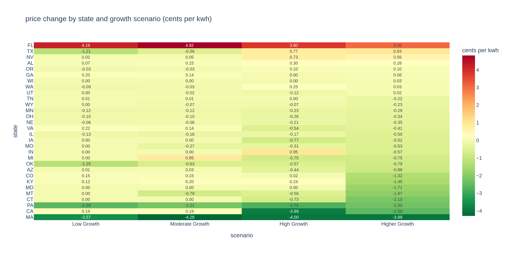

# The AI Boom Could Cost You Dearly: Data Center Explosion Projected to Raise Electricity Bills Across Dozens of States

---

## The Next Power Bill Shock May Not Come From Your Thermostat, but rather, from the facility across the street:

Across the United States, a quiet but massive shift is underway. Thousands of data centers, the ones that are classified as the "physical backbone" of artificial intelligence, cloud computing, and streaming services are being built at a pace the American power grid has never seen. Although most people will never see one, nor be inside one of such facilities, but millions may feel the consequences every month in the form of higher electricity bills as these power consuming monsters reign across the US for the next upcoming decade.

---

## Problem Statement

The United States is experiencing the largest surge in electricity demand since World War II. Data centers, which power everything from ChatGPT to Netflix, consumed roughly 176 terawatt-hours of electricity in 2023, which is about 4.4% of all U.S. electricity. By 2028, that figure could be more than tripling the baseline that we have at this time.

Unlike factories or office buildings, data centers are not evenly distributed. They cluster in specific states (Virginia, Texas, Oregon, Georgia) where land is cheap, fiber connectivity is strong, and power contracts are favorable. When a major data center cluster enters a state's grid, it competes for the same electricity that hospitals, schools, grocery stores, and small businesses rely on every day. That competition has a price, and right now, that price is not being paid by the technology companies building these facilities. It is being passed on to everyone else.

This project asks a simple but urgent question: **how much will commercial electricity prices rise in each U.S. state as projected data center growth comes online?**

---

## Solution Description

To figure this out, this project pulls together two datasets that don't usually talk to each other: monthly state-level electricity prices from the U.S. Energy Information Administration going all the way back to 2015, and county-level data center growth projections from a research group at Pacific Northwest National Laboratory called IM3.

A machine learning model was trained on over 6,900 historical state-month snapshots, learning how a state's data center energy consumption, the amount of energy generated through renewable channels , and its overall commercial electricity consumption all feed into what businesses end up paying per kilowatt-hour. That trained model was then pointed at four different futures (low, moderate, high, and higher growth), each one reflecting a different projection on how fast AI adoption and data center construction keeps moving.

The results show pretty clearly that the states getting hit hardest by new data center construction are also the ones facing the steepest price increases. Virginia, which already has more data center capacity than anywhere else in the country, could see commercial electricity prices climb by several cents per kilowatt-hour under the highest growth scenario. That might sound small, but for a school district or a small business running on thin margins, a few cents per kilowatt-hour might add up fast and build up the strain for that local school district. 

---

## Results by Growth Scenario

The chart below shows the projected change in commercial electricity price (in cents per kWh) across U.S. states under each of the four growth scenarios. The darker the color, the bigger the projected price increase.

*Figure 1: Projected change in commercial electricity price by state and growth scenario. Only states receiving new data center capacity under each scenario are shown.*

An interactive version of this visualization is in the form of a Choropleth map, where you can hover over individual states and flip between scenarios to see how pricing changes as the volume of data centers change. 

---

## What This Means

The people who end up paying more for electricity are almost never the people who decided to build the data center. A school district in Northern Virginia, a small diner in Georgia, a community clinic in Texas. None of them got a vote on whether a hyperscale facility moves in next door. But they all get the bill.

This project is meant to put some numbers behind a conversation that's already overdue. Policymakers, utilities, and local communities deserve to know what they're signing up for before these facilities break ground, not after the bills start arriving.

